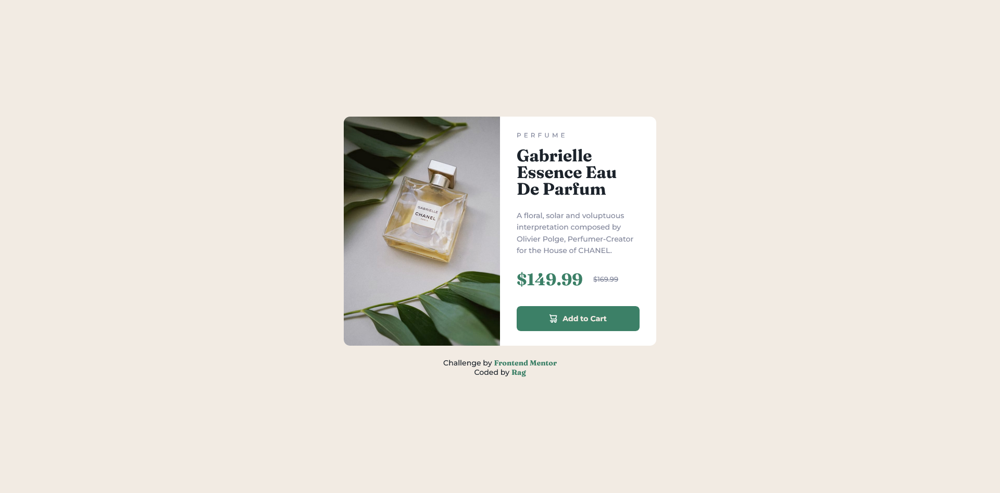
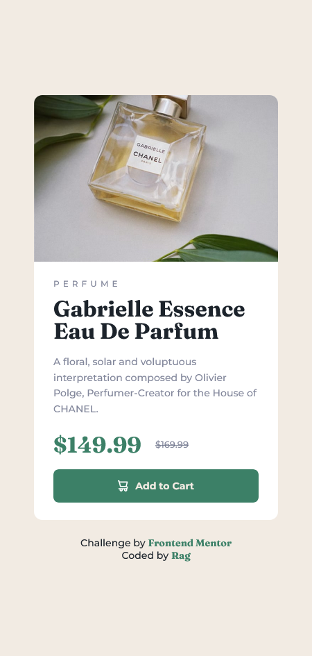
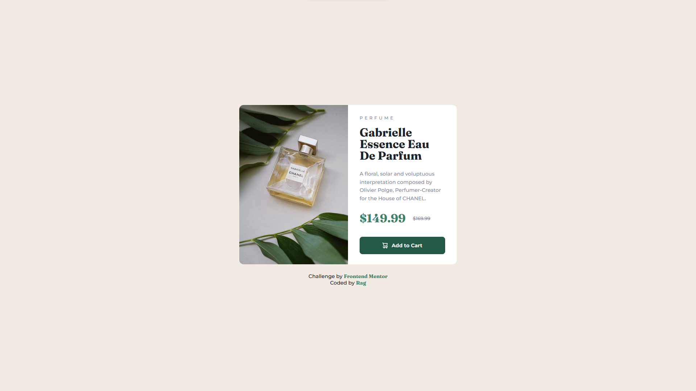
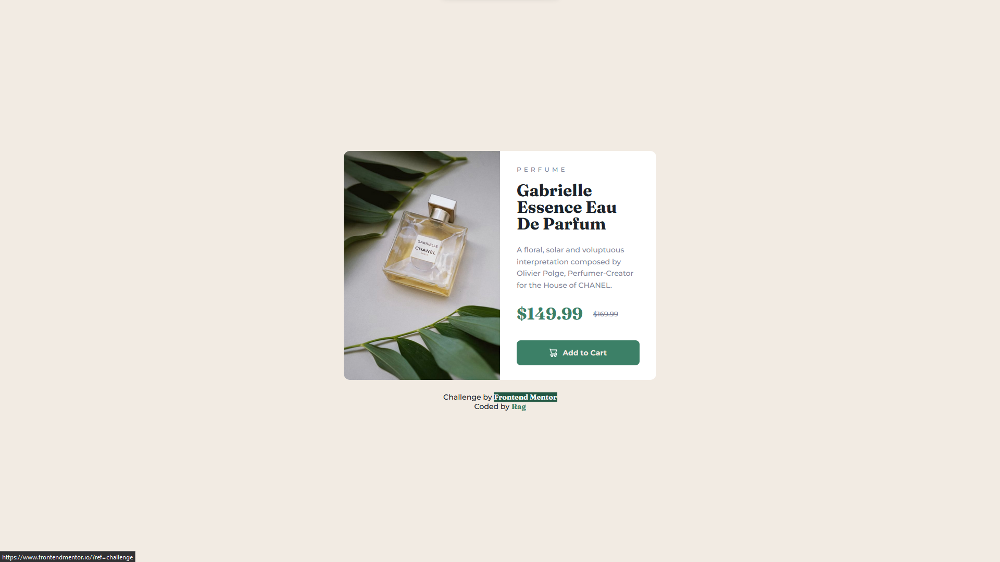

# Frontend Mentor - Product preview card component solution

This is a solution to the [Product preview card component challenge on Frontend Mentor](https://www.frontendmentor.io/challenges/product-preview-card-component-GO7UmttRfa). Frontend Mentor challenges help you improve your coding skills by building realistic projects. 

## Table of contents

- [Overview](#overview)
  - [The challenge](#the-challenge)
  - [Screenshots](#screenshots)
  - [Links](#links)
- [My process](#my-process)
  - [Built with](#built-with)
  - [What I learned](#what-i-learned)
  - [Useful resources](#useful-resources)
- [Author](#author)
- [Acknowledgments](#acknowledgments)

## Overview

### The challenge

Users should be able to:

- View the optimal layout depending on their device's screen size
- See hover and focus states for interactive elements

### Screenshots

- Desktop Site:



- Mobile Site:



- Hover State:



- Link Hover State Transition:



### Links

- [Solution](https://github.com/ragonscreen/frontend-mentor-product-preview-card-component)
- [Live Site](https://ragonscreen.github.io/frontend-mentor-product-preview-card-component/)

## My process

### Built with

- Semantic HTML5 markup
- CSS custom properties
- Flexbox
- Mobile-first workflow

### What I learned

- Using the `picture` tag to enclose an `img` tag then using the `srcset` and `media` attributes inside the `picture` tag is the easiest way to switch image sources that are to appear (e.g. the desktop and mobile versions of the product image in this case).

```html
<picture class="product__image">
  <source srcset="./images/image-product-desktop.jpg" media="(min-width: 675px)">
  
</picture>
```

Huge thanks to Kevin Powell and his awesome video [Easily change images WITHOUT any CSS or JS](https://www.youtube.com/shorts/d9i68C628Nk) for this great tip.

- A custom link hover transition usually looks much better than the generic underline. In this challenge I used a custom fill transition as follows:

```css
.attribution a {
  text-decoration: none;
  color: var(--clr-400);

  position: relative;
  transition: color 200ms;
}

.attribution a:hover,
.attribution a:focus {
  outline: none;
  color: var(--clr-100);
}

.attribution a::after {
  content: '';
  position: absolute;
  inset: 0;
  width: 101%;
  background: var(--clr-200);
  z-index: -1;

  transform: scaleX(0);
  transform-origin: left;
  transition: transform 300ms, background-color 600ms;
}

.attribution a:hover::after,
.attribution a:focus::after {
  background: var(--clr-500);
  transform: scaleX(1);
}
```

The result turned out great and if I were to use any other contrasting colors except the "Dark Cyan" color provided in the challenge (to have a sense of consistency), the transition would have popped out even more than it did.

### Useful resources

- [Easily change images WITHOUT any CSS or JS](https://www.youtube.com/shorts/d9i68C628Nk) - As mentioned previously, Kevin's video helped me undertand the easiest way to switch image sources without the need of media queries.

## Author

- Frontend Mentor - [@ragonscreen](https://www.frontendmentor.io/profile/ragonscreen)

## Acknowledgments

- As always, I would like to thank [Kevin Powell](https://www.youtube.com/@KevinPowell) for introducing me to Frontend Mentor and his other awesome CSS guides.
